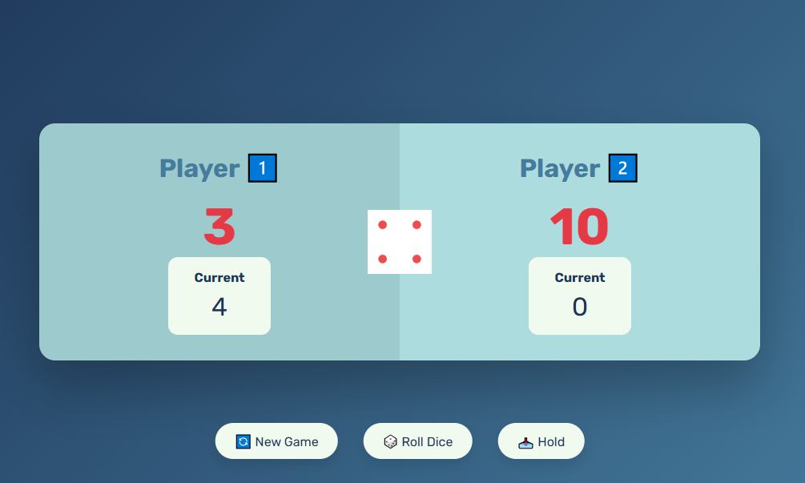

# 🎲 Dice Game — A Two-Player Dice Game in JavaScript

A simple, fun, and interactive dice game for two players, built with pure JavaScript, HTML, and CSS. This project was created as a pet project to practice DOM manipulation, game logic, and UI design.

## 🎮 Game Rules

- Two players take turns to roll a dice.
- Each roll (except 1) adds the number to the player's **current score**.
- If the player rolls a **1**, their current score resets and it's the other player's turn.
- A player can **"Hold"** their score to add it to their **total score**.
- The first player to reach **100 points** wins the game.

---

## 📸 Screenshot

---

## 🚀 Live Demo

Try the game live:  
👉 [Play on GitHub Pages](https://yourusername.github.io/dice-game)

